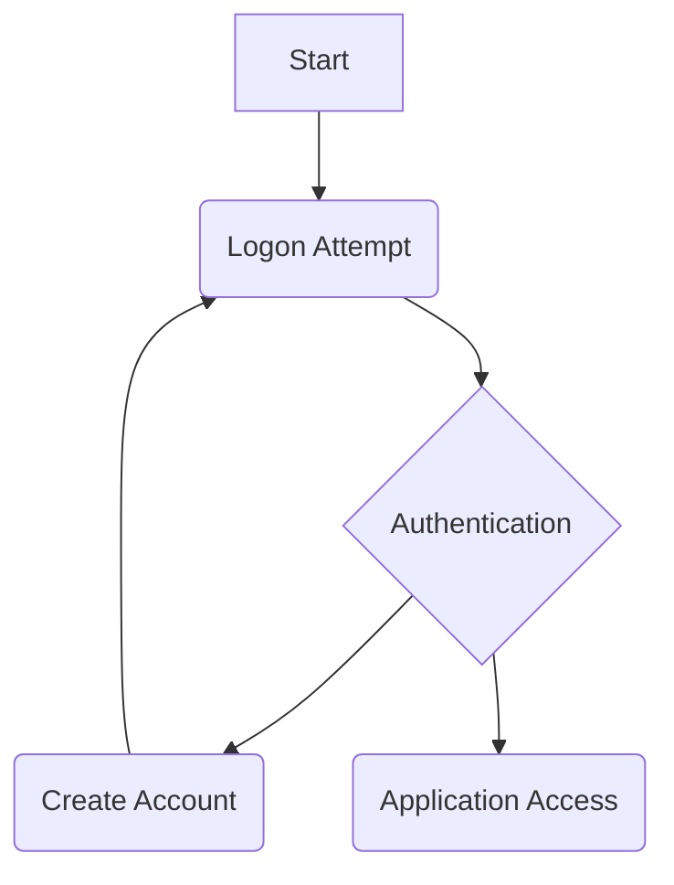
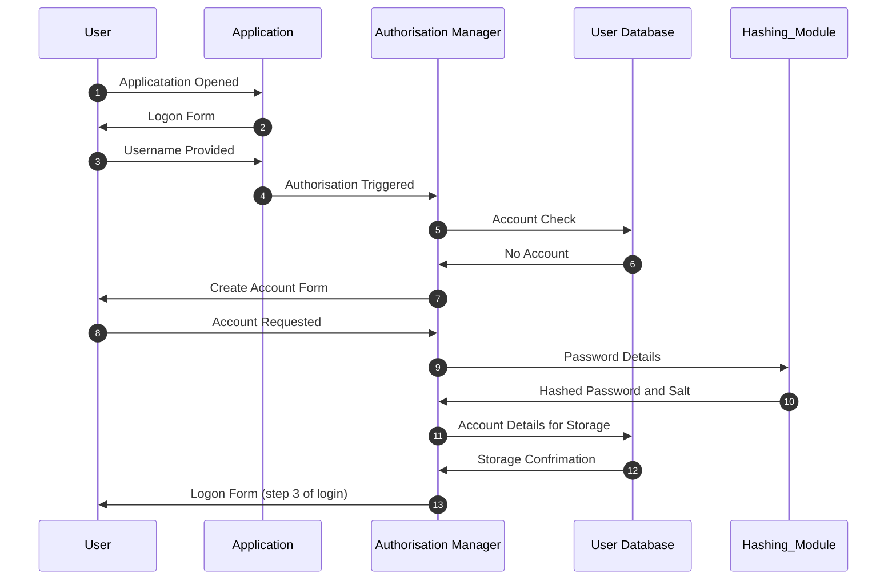
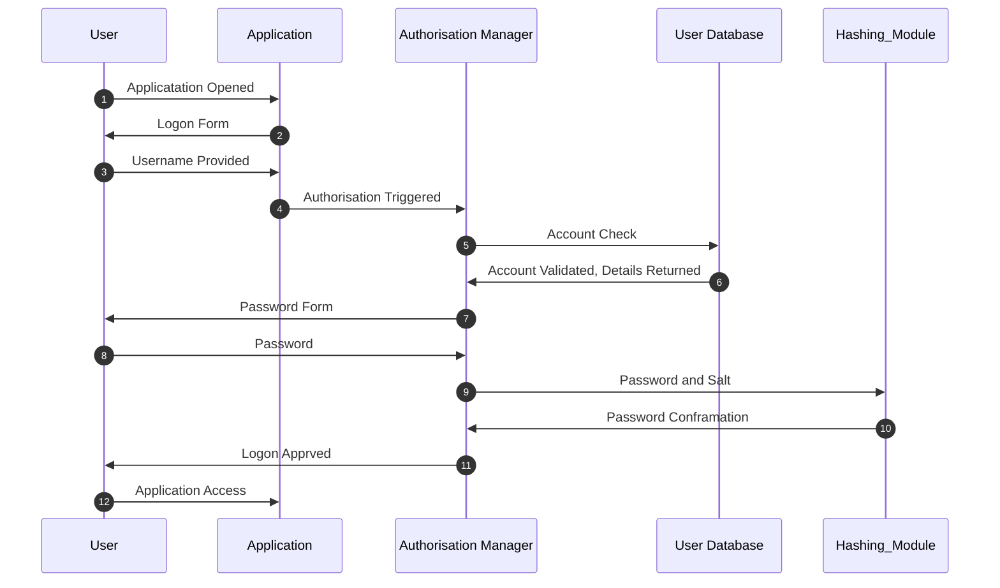
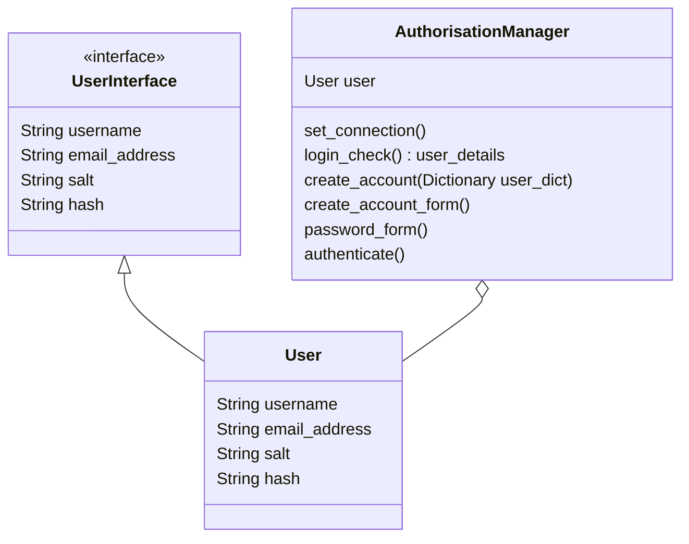

```mermaid
graph TD;
    A[Start]-->B(Logon Attempt);
    B-->C{Authentication};
    C-->D(Create Account);
    D-->B;
    C-->E(Application Access);
```
---

Interaction of a user with no valid account (Account Creation).

```mermaid
sequenceDiagram;
    AutoNumber;
    participant User;
    participant Application;
    participant Authorisation Manager;
    participant User Database;
    participant Hashing_Module;
    User->>Application: Applicatation Opened;
    Application->>User: Logon Form;
    User->>Application: Username Provided;
    Application->>Authorisation Manager: Authorisation Triggered;
    Authorisation Manager->>User Database: Account Check;
    User Database->>Authorisation Manager: No Account;
    Authorisation Manager->>User: Create Account Form;
    User->>Authorisation Manager: Account Requested;
    Authorisation Manager->>Hashing_Module: Password Details;
    Hashing_Module->>Authorisation Manager: Hashed Password and Salt;
    Authorisation Manager->>User Database: Account Details for Storage;
    User Database->>Authorisation Manager: Storage Confrimation;
    Authorisation Manager->>User: Logon Form (step 3 of login);

```
---
Interaction of a user with valid account (Login).

```mermaid
sequenceDiagram;
    AutoNumber;
    participant User;
    participant Application;
    participant Authorisation Manager;
    participant User Database;
    participant Hashing_Module;
    User->>Application: Applicatation Opened;
    Application->>User: Logon Form;
    User->>Application: Username Provided;
    Application->>Authorisation Manager: Authorisation Triggered;
    Authorisation Manager->>User Database: Account Check;
    User Database->>Authorisation Manager: Account Validated, Details Returned;
    Authorisation Manager->>User: Password Form;
    User->>Authorisation Manager: Password;
    Authorisation Manager->>Hashing_Module: Password and Salt;
    Hashing_Module->>Authorisation Manager: Password Conframation;
    Authorisation Manager->>User: Logon Apprved;
    User->>Application: Application Access;
```
---
Authentication Process Class Diagram

```mermaid
classDiagram
    class UserInterface {
        <<interface>>
        String username
        String email_address
        String salt
        String hash
    }
    class User{
        String username
        String email_address
        String salt
        String hash        
    }
    class AuthorisationManager {
        User user
        set_connection()
        login_check() user_details
        create_account(Dictionary user_dict)
        create_account_form()
        password_form()
        
        authenticate()
    }
    UserInterface <|-- User
    AuthorisationManager o-- User

```